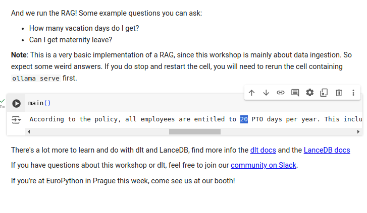

# Open source data ingestion for RAGs with dlt

Video: https://www.youtube.com/watch?v=qUNyfR_X2Mo

In this hands-on workshop, we’ll learn how to build a data ingestion pipeline using dlt to load data from a REST API into LanceDB so you can have an always up to date RAG.

​We’ll cover the following steps:

* Extract data from REST APIs
* Loading and vectorizing into LanceDB, which unlike other vector DBs stores the data _and_ the embeddings
* Incremental loading

​By the end of this workshop, you’ll be able to write a portable, OSS data pipeline for your RAG that you can deploy anywhere, such as python notebooks, virtual machines, or orchestrators like Airflow, Dagster or Mage.


# Resources

* Slides: [dlt-LLM-Zoomcamp.pdf](https://github.com/user-attachments/files/16131729/dlt.LLM.Zoomcamp.pdf)
* [Google Colab notebook](https://colab.research.google.com/drive/1nNOybHdWQiwUUuJFZu__xvJxL_ADU3xl?usp=sharing) - make a copy to follow along!

--- 

# Homework

In the workshop, we extracted contents from two pages in notion titled "Workshop: Benefits and Perks" and "Workshop: Working hours, PTO, and Vacation". 

Repeat the same process for a third page titled "Homework: Employee handbook" (hidden from public view, but accessible via API key):

1. Modify the REST API source to extract only this page.
2. Write the output into a separate table called "homework".
3. Remember to update the table name in all cells where you connect to a lancedb table.

To do this you can use the [workshop Colab](https://colab.research.google.com/drive/1nNOybHdWQiwUUuJFZu__xvJxL_ADU3xl?usp=sharing) as a basis.

Now, answer the following questions:  

## Q1. Rows in LanceDB

How many rows does the lancedb table "notion_pages__homework" have?

* **14** (answer)
* 15
* 16
* 17


## Q2. Running the Pipeline: Last edited time

In the demo, we created an incremental dlt resource `rest_api_notion_incremental` that keeps track of `last_edited_time`. What value does it store after you've run your pipeline once? (Hint: you will be able to get this value by performing some aggregation function on the column `last_edited_time` of the table)

* **`Timestamp('2024-07-05 22:34:00+0000', tz='UTC') (OR "2024-07-05T22:34:00.000Z")`** (answer)
* `Timestamp('2024-07-05 23:33:00+0000', tz='UTC') (OR "2024-07-05T23:33:00.000Z")`
* `Timestamp('2024-07-05 23:52:00+0000', tz='UTC') (OR "2024-07-05T23:52:00.000Z")`
* `Timestamp('2024-07-05 22:56:00+0000', tz='UTC') (OR "2024-07-05T22:56:00.000Z")`


## Q3. Ask the Assistant 

Find out with the help of the AI assistant: how many PTO days are the employees entitled to in a year?  

* **20** (answer)
* 25
* 30
* 35




```python
main()
```

```plain
Assistant: Thank you for asking me your question regarding the employee handbook! 
Regarding how many Paid Time Off (PTO) days employees are entitled to, I would like 
to remind you that it is mentioned in the context provided by you. According to the 
policy, all employees are entitled to 20 PTO days per year. This includes full-time 
and part-time employees. Please refer to your HR department for any further 
information regarding this topic as they may have specific policies or procedures 
related to each employee's situation. I hope that helps!
```


## Submit the results

* Submit your results here: https://courses.datatalks.club/llm-zoomcamp-2024/homework/workshop1
* It's possible that your answers won't match exactly. If it's the case, select the closest one.
